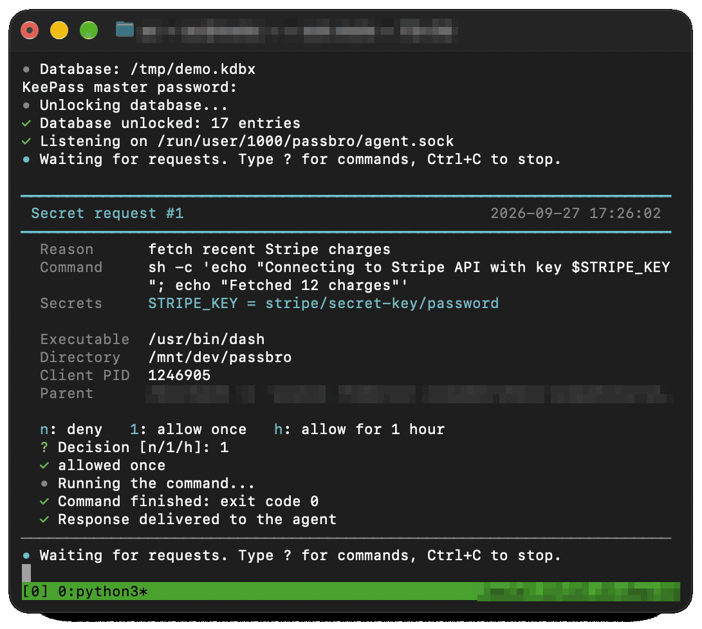

# passbro

Secret broker for AI agents, backed by a KeePass (`.kdbx`) database.

## Problem

AI coding agents need API keys and passwords to run commands. Pasting secrets
into the chat or leaving them in files exposes them to the model, its logs and
its context.

## Solution

The agent asks for a secret; the owner approves the request in their own
terminal. The secret is injected into the environment of the launched command
only, and never shows up in the agent's output.



## How it works

- `passbro agent` runs in the owner's terminal, unlocks the KeePass database and
  listens on a Unix socket.
- `passbro run` (called by the agent) sends the command, the reason and the
  requested entries; the broker shows a confirmation prompt.
- On approval the broker runs the command with secrets in its environment and
  masks secret values in its output as `[hidden]`.
- Every decision is written to an audit log (`~/.local/state/passbro/log.jsonl`).

## Threat model

passbro keeps secrets out of the agent's context: out of the chat, the model
provider's servers, agent logs and plaintext files. Secrets live only in the
encrypted KeePass database and in the memory of the broker and the approved
command.

It does not protect against a malicious or compromised agent:

- An approved command has the secret. It can send it anywhere, write it to a
  file, or print it encoded (base64, reversed) so masking does not catch it.
  Read the command before approving.
- Masking is best effort: only exact values of 4+ characters are replaced.
- An `h` grant approves the same command for an hour without asking; if the
  agent can modify the script or executable, it can change what runs.
- Any process of the same Unix user can send requests (each still needs
  approval) and, if the system allows ptrace, read the broker's memory.
- A compromised owner account or machine (keylogger, root) is out of scope.

## Install

Requires Linux, Python 3 and `pykeepass` (Debian: `sudo apt install python3-pykeepass`).

Download `passbro.pyz` from Releases, or build it from source:

```sh
make build        # -> dist/passbro.pyz
make test
```

## Usage

Owner, in a separate terminal:

```sh
passbro agent --db ~/secrets.kdbx
```

Agent:

```sh
passbro ls
passbro run --why "fetch recent Stripe charges" -e STRIPE_KEY=stripe/secret-key/password -- ./stripe-charges.sh
```

`-e NAME=entry/path/field` maps a KeePass entry field to an environment variable.

## License

MIT
